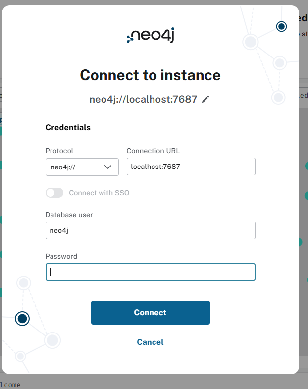

# VulGPT
## Setup
Firstly you will want to install Neo4j into your machine based on your operating system. https://neo4j.com/docs/operations-manual/current/installation/
Note for the sake of this set up process, it was done on a linux enviroment. Once installed you are able to start up neo4j with the following command. 
```
sudo systemctl start neo4j
```
Additionally you can make sure neo4j is properly running using the following command. 
```
sudo systemctl status neo4j
```
You are then able to access neo4j through the browser often thorugh the port 7474 or 7687. Once connected you'll see a log in screen that is similar to the following image. The default username and password will be neo4j, afterward it will ask you to change it. 



Once logged in youll be able to see your data once you've uploaded it, which can be done by using the neo4j scripts. You'll first want to download the OSV data which can be downloaded thorugh the follwoing link  https://osv-vulnerabilities.storage.googleapis.com/all.zip or thorugh the following command. Note make sure to unzip the folder. Note: this is the entitery of the OSV data, which is used for the initial set up. It is about of 5 GB at the time of writting. 
```
wget https://osv-vulnerabilities.storage.googleapis.com/all.zip
```
Once installed you are able to run loadOSVdataset.py, Note make sure to add your Neo4j log in information and file path to the dataset folder. Followed by the process_cve.py script, and upload_git.py. Which will all upload the data to the neo4j.
## Usage

## Streamlit
To view the application running this command allows you to visualize the data which utilizes neo4j queries.
```
streamlit run Home.py
```
## Auto Update
Installing tmux.
```
sudo apt update
sudo apt install tmux
```
If your wanting run the auto update on the gcp instance tmux can be used. Not only can it used for the scheduler.py but also the streamlit application.
```
tmux new -s auto_update -d 'python3 scheduler.py'
```
Other useful commands to either view the list of current scripts running or to get into that terminal to terminate that script.
```
tmux ls
```
```
tmux attach -t 'auto_update'
```

## llm set up

The main thing you will need to run the llm used in this github is a hugging face account and you will need to request access for the [meta llama 3.1 model collections](https://huggingface.co/collections/meta-llama/llama-31-669fc079a0c406a149a5738f). You will need to create a hugging face token and run the following command while in your python environment 
```
huggingface-cli login
```
after running that command it should ask you to input your hugging face token, after that is complete you are all set up to use the llm


